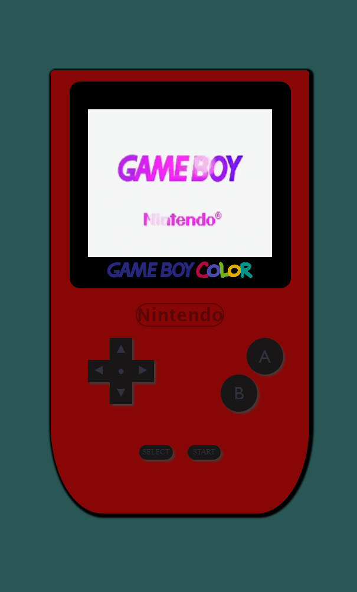

# Project Videoconsole

## Table of Contents

- [About](#about)
- [Getting Started](#getting-started)
- [Prerequisites](#prerequisites)
- [Acknowledgments](#acknowledgements)

## About 

Elaboración de la estructura de una videoconsola usando HTML, CSS y JavaScript para funciones interactivas

## Getting Started

Techniques learned in HTML are applied together with CSS styles and functions, to achieve an interactive and dynamic design through the application of JavaScript.

### Prerequisites

-Access to a code editor is required.

[Demo](https://cesarparada.github.io/Proyecto-Videoconsola/)

## Acknowledgements

-Prof. Fidel Gilart.
-Prof. Mara Scampini.
